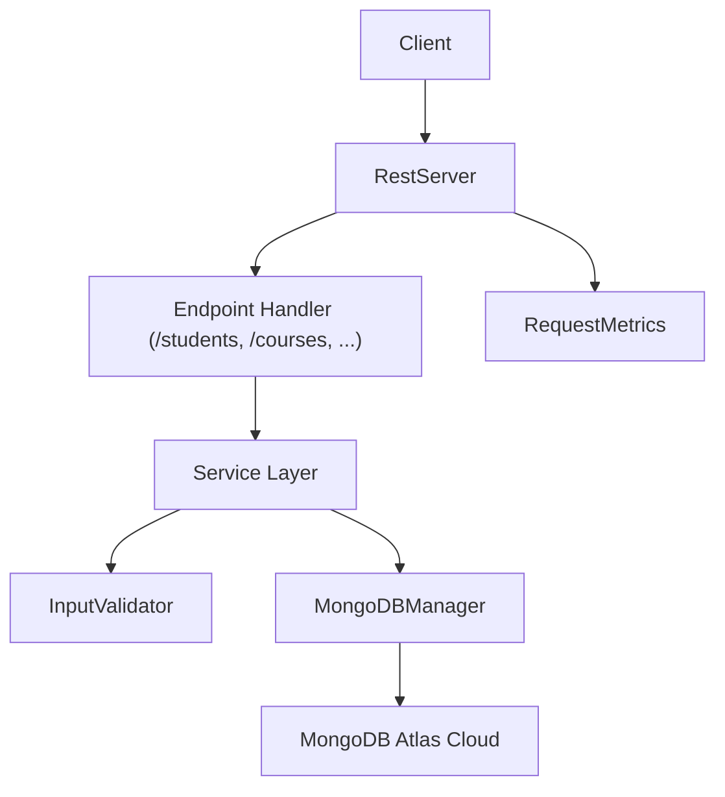

# 📘 API Documentation — Student Management System (Java HTTP Server)

This document describes the REST API I built using Java’s built-in  
`com.sun.net.httpserver.HttpServer`.  
No Spring Boot, no heavy frameworks — just a clean, minimal, "learn-the-internals" backend.

The goal was to understand HTTP fundamentals, write JSON manually using a small ResponseBuilder,  
and expose CRUD operations for Students, Courses, and Enrollments.

All APIs run live using the Railway Docker deployment.

---

# 🌍 Base URL (Live on Railway)


[https://studymanagementsystem-production.up.railway.app](https://studymanagementsystem-production.up.railway.app)

Exposed endpoints for monitoring : [https://studymanagementsystem-production.up.railway.app/metrics](https://studymanagementsystem-production.up.railway.app/metrics)

- [Index](https://studymanagementsystem-production.up.railway.app/)
- [Students](https://studymanagementsystem-production.up.railway.app/students)
- [Courses](https://studymanagementsystem-production.up.railway.app/courses)
- [Enrollments](https://studymanagementsystem-production.up.railway.app/enrollments)


If the server is sleeping, Railway wakes it automatically within 2–3 seconds.

---

# 📘 Index Endpoint

## **GET /**

### Purpose  
Quick health check. Shows available routes.

### Example Response

```json
{
  "message": "Student Management System Backend Running",
  "endpoints": ["/students", "/courses", "/enrollments", "/metrics"]
}
````

---

# 📊 Metrics Endpoint

## **GET /metrics**

### Purpose

Shows basic server metrics:

* total requests
* timestamp
* per-endpoint counters

### Example Response

```json
{
  "totalRequests": 42,
  "endpoints": {
    "/students": 18,
    "/courses": 14,
    "/enrollments": 10
  },
  "lastUpdated": "2025-11-30T18:44:10"
}
```

This is a tiny "custom Prometheus" written from scratch using `RequestMetrics`.

---

# 🎓 Student API

## **GET /students**

Returns a list of all students.

### Sample Response

```json
[
  {
    "id": "S101",
    "name": "Priya",
    "email": "priya@example.com",
    "year": 2
  },
  {
    "id": "S102",
    "name": "Rahul",
    "email": "rahul@example.com",
    "year": 3
  }
]
```

---

## **POST /students**

Adds a new student.

### Example Request Body

```json
{
  "id": "S103",
  "name": "Aarav",
  "email": "aarav@example.com",
  "year": 1
}
```

### Success Response

```json
{
  "status": "success",
  "message": "Student added successfully"
}
```

### Error Response (Invalid Input)

```json
{
  "status": "error",
  "message": "InvalidDataException: email format incorrect"
}
```

### Error Response (Duplicate)

```json
{
  "status": "error",
  "message": "Student already exists"
}
```

---

# 📚 Course API

## **GET /courses**

Returns all available courses.

### Example Response

```json
[
  {
    "courseId": "C101",
    "courseName": "Data Structures",
    "credits": 4
  }
]
```

---

## **POST /courses**

### Example Request Body

```json
{
  "courseId": "C202",
  "courseName": "Operating Systems",
  "credits": 3
}
```

### Success Response

```json
{
  "status": "success",
  "message": "Course added successfully"
}
```

---

# 📝 Enrollment API

Enrollment links a student → course.

---

## **GET /enrollments**

Returns all enrollment records.

### Sample Response

```json
[
  {
    "studentId": "S101",
    "courseId": "C101",
    "enrolledOn": "2025-11-30T12:15:20"
  }
]
```

---

## **POST /enrollments**

### Example Request Body

```json
{
  "studentId": "S103",
  "courseId": "C202"
}
```

### Success Response

```json
{
  "status": "success",
  "message": "Enrollment completed"
}
```

### Error Response (student not found)

```json
{
  "status": "error",
  "message": "StudentNotFoundException: Student with ID S999 not found"
}
```

---

# 🔍 Input Validation Summary

Validation is done using `InputValidator.java`:

* Empty fields → rejected
* Invalid email format → rejected
* Missing IDs → rejected
* Numeric fields validated
* All service-layer methods throw custom exceptions:

    * `InvalidDataException`
    * `StudentNotFoundException`

This keeps the API safe even without frameworks.

---

# 🧱 Internal Structure (High-Level API Flow)



---

# 🔧 How JSON is Built (Manual Approach)

Because no frameworks were used, I created a custom **ResponseBuilder**:

Example:

```java
return ResponseBuilder.json()
        .add("status", "success")
        .add("message", "Student added successfully")
        .build();
```

This made learning easier and gave full control over the JSON output.

---

# 🧪 Testing the API

You can test all endpoints using:

### ✔ Browser

(for GET endpoints)

### ✔ curl

```bash
curl https://studymanagementsystem-production.up.railway.app/students
```

### ✔ Postman

Really useful for POST requests.

---

# 🚀 Deployment Notes

* The backend runs inside a **Docker container** on Railway.
* Dockerfile uses OpenJDK 21.
* Railway automatically exposes port **8080**.
* Logs can be viewed inside the Railway dashboard.
* The API wakes instantly on request.

---

# 🧩 Future Improvements (If I extend the project)

* Add PATCH/PUT for updates
* Add DELETE endpoints
* Implement authentication
* Add indexing in MongoDB
* Add pagination for large student lists
* Add CSV export/import

---

# ✔ End of API Documentation

This API doc matches the live backend, the class structure, the services, and the behavior of the REST server exactly.

```


