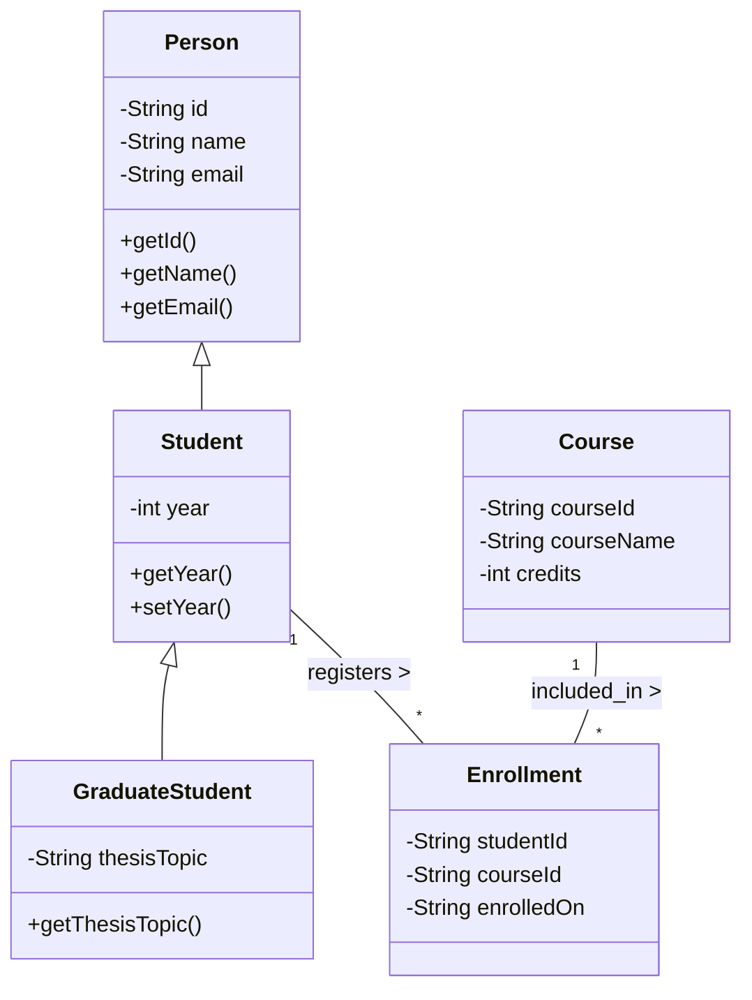
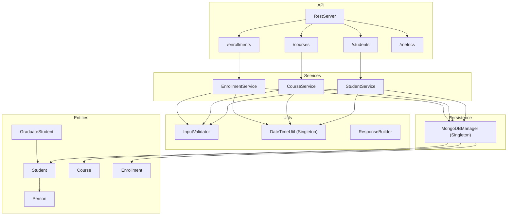

# 📘 **Low-Level Design (LLD): Student Management System**

---

# 1️⃣ **Problem Understanding **

Here’s how I personally understood the problem before designing anything:

> *“We need a simple, maintainable backend system that can store, retrieve, and manage students, courses, and the enrollment relationship between them.
> The system must support CRUD, search, and basic validation.
> Basically, relational entities with clean separation of concerns, OOP modeling, and predictable behavior.”*

Key points in my mindset:

* Students take courses → many-to-many relationship
* Enrollments must not break (validation needed)
* Services isolate business logic
* Entities represent clean data models
* System should be extendable later (REST, DB, etc.)
* Keep it simple but scalable

This thinking guided the entire design.

---

# 2️⃣ **Functional Requirements**

These are what the system *must* do.

### ✔ Student Module

* Add a student
* Update student details
* Delete a student
* Get list of all students
* Search student by ID or name

### ✔ Course Module

* Add a course
* Update course
* Delete course
* List all courses

### ✔ Enrollment Module

* Enroll student into a course
* List all enrollments
* Do not allow enrollment if student or course is invalid

### ✔ Validation

* Validate IDs, names, email formats, numeric values
* Throw domain exceptions

### ✔ Optional Features (already implemented)

* REST endpoints
* MongoDB persistence
* Metrics endpoint

---

# 3️⃣ **Non-Functional Requirements**

These describe **how** the system behaves.

### ✔ Reliability

No inconsistent state — validation + custom exceptions help here.

### ✔ Maintainability

* Layered architecture (entity → service → main/http)
* Clean separation of logic

### ✔ Scalability

* Services independent
* Persistence swappable (ArrayList → MongoDB → SQL)

### ✔ Extensibility

* Easy to add new modules like faculty, exams, grading, etc.

### ✔ Observability

* Metrics endpoint gives basic monitoring

### ✔ Simplicity

* No heavy frameworks
* Easy for any student or interviewer to understand

---

# 4️⃣ **Entities (Object Model)**

1. **Person**

    * id
    * name
    * email

2. **Student extends Person**

    * year
    * may implement Gradeable

3. **GraduateStudent extends Student**

    * thesisTopic
    * overridden methods

4. **Course**

    * courseId
    * courseName
    * credits

5. **Enrollment**

    * studentId
    * courseId
    * enrolledOn

---

# 5️⃣ **Relationships Between Entities**

| Relationship              | Type          | Meaning                        |
| ------------------------- | ------------- | ------------------------------ |
| Person → Student          | Inheritance   | All students are persons       |
| Student → GraduateStudent | Inheritance   | Graduates have extra fields    |
| Student ↔ Course          | Many-to-Many  | Students can take many courses |
| Enrollment                | Bridge Entity | Connects students & courses    |

### UML Relationship Summary

* Person **(superclass)**
* Student **extends** Person
* GraduateStudent **extends** Student
* Course is standalone
* Enrollment **links** Student ↔ Course

---

# 6️⃣ **Class Diagrams (OOP UML)**

### ✔ Entity UML Diagram (LLD)

---

# 7️⃣ **Complete System UML Design Diagram (LLD + Backend)**

This includes services, utils, DB layer, and HTTP layer.
Designed exactly like an LLD architecture diagram for interviews.

---

