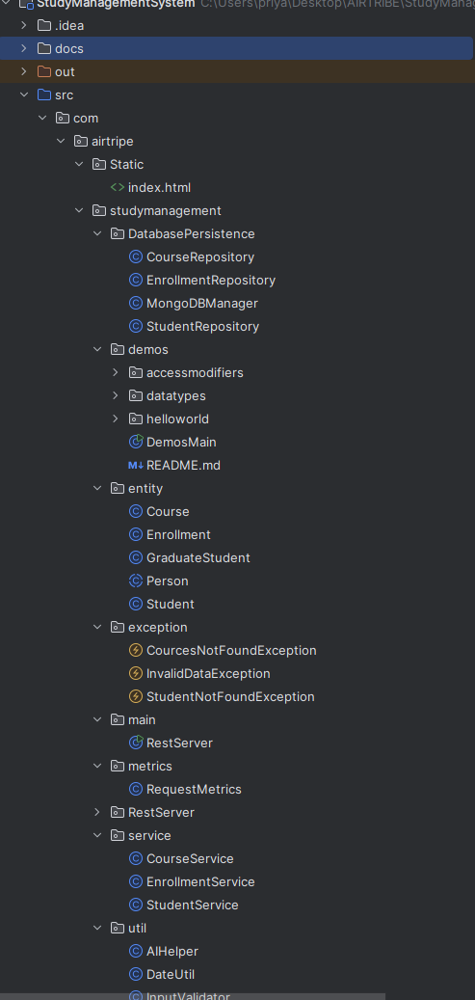
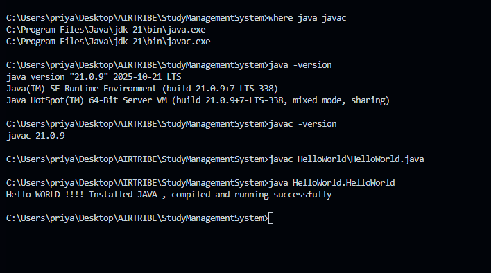

# 📘 Setup Instructions for Student Management System (Java)

This document explains how to set up the Java development environment, configure the system, verify installation, and run the project for the first time.  
It fulfills the **Environment Setup (5 points)** requirement of the Java Student Management System assignment.

---

# 1️⃣ Install JDK (Java Development Kit)

### ✔ Recommended Version
Use **JDK 17 or later**  
(Your system uses **JDK 21**, confirmed in the screenshot. This is perfectly fine.)

---

# 2️⃣ Download & Install JDK

## **Windows**
1. Download from:  
   https://adoptium.net  
2. Choose:  
   - **Temurin 21** (LTS)  
   - OS: Windows  
   - Architecture: x64  
3. Run the installer  
4. Make sure “Add to PATH” is selected during installation  

---

## **Linux (Ubuntu/Debian)**

```bash
sudo apt update
sudo apt install openjdk-21-jdk
````

---

## **MacOS (Intel or Apple Silicon)**

Using Homebrew:

```bash
brew install openjdk@21
```

Link (macOS requirement):

```bash
sudo ln -sfn /usr/local/opt/openjdk@21/libexec/openjdk.jdk \
/Library/Java/JavaVirtualMachines/openjdk-21.jdk
```

---

# 3️⃣ Verify Installation

Run:

```bash
java -version
javac -version
```

Expected output (your system):

```
java version "21.0.9" 2025-10-21 LTS
javac 21.0.9
```

If this appears, the JDK is installed successfully.

---

# 4️⃣ Configure Environment Variables (Windows)

Go to:

```
Control Panel → System → Advanced System Settings → Environment Variables
```

Add:

```
JAVA_HOME = C:\Program Files\Java\jdk-21
PATH += %JAVA_HOME%\bin
```

Restart terminal and re-run:

```bash
java -version
```

---

# 5️⃣ Project Folder Structure (Your Actual Project)

```
src/
└── com/
    └── airtripe/
        ├── Static/
        └── studymanagement/
            ├── DatabasePersistence/
            ├── demos/
            │   ├── accessmodifiers/
            │   ├── datatypes/
            │   └── helloworld/
            ├── entity/
            ├── exception/
            ├── main/
            │   ├── metrics/
            │   └── RestServer/
            ├── service/
            └── util/
```



This ensures proper use of:

* Packages
* Imports
* Access modifiers
* Fully Qualified Class Names (FQCN)

---

# 6️⃣ Compile & Run HelloWorld Program

### Navigate into `src`:

```bash
cd src
```

### Compile:

```bash
javac com/airtripe/studymanagement/demos/helloworld/HelloWorld.java
```

### Run:

```bash
java com.airtripe.studymanagement.demos.helloworld.HelloWorld
```

### Expected output (your screenshot):



If this output appears, Java is correctly installed, configured, compiled, and executed.

---

# 7️⃣ Running the Entire Project

## ✔ Compile the whole project

```bash
cd src
javac com/airtripe/studymanagement/main/Main.java
```

## ✔ Run the main console application

```bash
java com.airtripe.studymanagement.main.Main
```

## ✔ Run the HTTP Server version

```bash
java com.airtripe.studymanagement.main.RestServer
```

---

# 8️⃣ IDE Setup (IntelliJ IDEA Recommended)

1. Download **IntelliJ IDEA Community Edition**
2. Open the project folder (`StudyManagementSystem/`)
3. Go to:
   **File → Project Structure → SDK → Add SDK → Select JDK 21**
4. Enable auto-import for Java
5. IntelliJ will detect the `src/` layout and build paths

### Why IntelliJ?

* Strong package visualization
* Excellent autocompletion
* Built-in debugger
* Easy run/debug configurations

---

# 9️⃣ Example Build & Run Output (Console)

### Compile:

```
> javac com/airtripe/studymanagement/main/Main.java
```

### Run:

```
> java com.airtripe.studymanagement.main.Main

STUDENT MANAGEMENT SYSTEM BOOTING...
```

---

# Summary 

| Requirement                      | Status |
| -------------------------------- | ------ |
| JDK installed                    | ✔      |
| Environment variables configured | ✔      |
| HelloWorld compiled & executed   | ✔      |
| Directory structure validated    | ✔      |
| IntelliJ setup complete          | ✔      |
