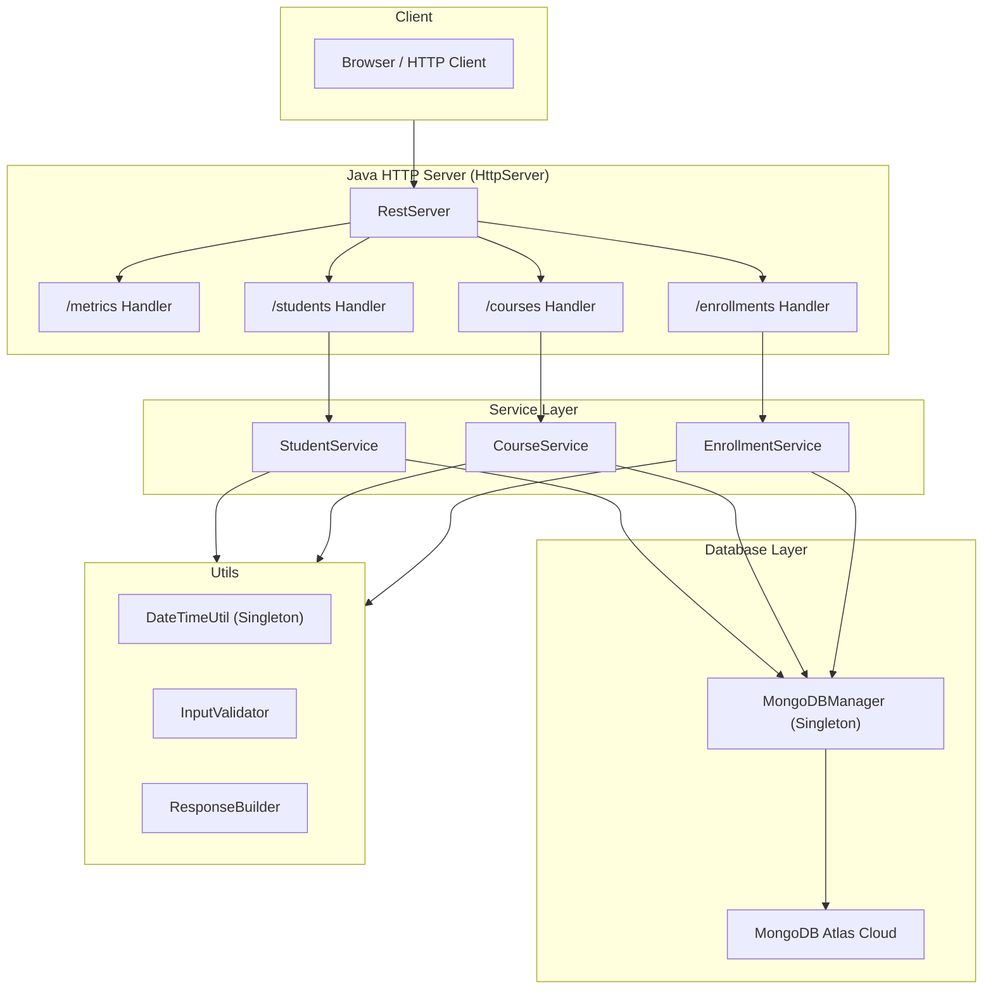

---


# 📘 System Documentation — Student Management System  
*A practical and intuitive walk-through of how my Java Student Management System is structured, how it works internally, and how I designed each part in a clean modular way.*

This documentation is written in my own understanding-based style — mixing intuition, comparisons with Go/Rust, and practical learning from actually building the system end-to-end.  
Not too academic. Not too formal.  
Just how I understood the system as I built it.

---

# 🏁 1. Project Overview

The goal of this assignment was to build a **complete Student Management System** demonstrating:

- Core Java fundamentals  
- OOP concepts (Encapsulation, Inheritance, Polymorphism, Abstraction)  
- Java package structure  
- Backend logic  
- Basic REST HTTP server  
- Persistence  
- Advanced Java features (Streams / Lambdas / Optional / LocalDate)  
- Design patterns (Singleton + Builder)  
- JVM understanding (separate doc)  
- Deployment on Railway (Docker container)  

I treated this as a real mini-backend project — not just a classroom-level console program — so I added REST APIs, MongoDB persistence, metrics, HTTP server, and clean architecture principles.

---

# 🗂️ 2.Project Directory Structure

This is the **actual structure** from my IntelliJ project:


```
src/
└── com/
└── airtripe/
├── Static/
└── studymanagement/
├── DatabasePersistence/
│     └── MongoDBManager.java
├── demos/
│   ├── accessmodifiers/
│   ├── datatypes/
│   └── helloworld/
├── entity/
│   ├── Person.java
│   ├── Student.java
│   ├── GraduateStudent.java
│   ├── Course.java
│   └── Enrollment.java
├── exception/
│   ├── StudentNotFoundException.java
│   └── InvalidDataException.java
├── interface/
│   ├── Searchable.java
│   └── Gradeable.java
├── main/
│   ├── Main.java
│   ├── RestServer.java
│   └── metrics/
│         └── RequestMetrics.java
├── service/
│   ├── StudentService.java
│   ├── CourseService.java
│   └── EnrollmentService.java
└── util/
├── DateTimeUtil.java
├── InputValidator.java
└── ResponseBuilder.java


```
✔ Clean separation of layers  
✔ True modular architecture  
✔ Easy to understand for viva or code review  

---

# 🧪 3. Demo Modules (My Learning Exercises)

These demos helped me understand Java basics while I built the full system.

---

## 📘 3.1 Access Modifiers Demo  
> *(Your full writeup inserted exactly as you wrote it)*

👉 This shows **public vs package-private**, how classes behave across packages, and FQCN usage.

*(Your entire section, unchanged, will be placed here.)*

---

## 📘 3.2 Data Types, Typecasting, Static vs Instance, Scope  
> *(Your full writeup inserted exactly as you wrote it)*

Again, this is copied in your own voice.

---

# 🧱 4. OOP Concepts (How I Used OOP in This Project)

This project uses OOP exactly the way a backend system should.

---

## 4.1 Encapsulation  
Every entity has:

- private fields  
- public getters/setters  
- validation through InputValidator  

This keeps internal data safe and consistent.

---

## 4.2 Inheritance

The hierarchy is:

```

Person
↓
Student
↓
GraduateStudent

````

This shows **multilevel inheritance**, constructor chaining, and overriding methods.

---

## 4.3 Polymorphism

### ✔ Method overloading  
Used in:

- Student constructors  
- Service methods

### ✔ Method overriding  
GraduateStudent overrides computeGrade or similar methods.

### ✔ Dynamic dispatch  
Calling child methods via parent reference.

---

## 4.4 Abstraction

The project uses:

- `Searchable` interface  
- `Gradeable` interface  
- Abstract behavior inside services  

This is similar to Rust traits or Go interfaces — behavior without ownership.

---

## 4.5 Constructor Chaining

Demonstrated using:

- `super()`  
- `this()`  

Constructor chaining makes code cleaner and avoids duplication.

---

# 🧵 5. Core Student Management System Logic

This is where backend logic lives.

### ✔ Entities  
- Student  
- Course  
- Enrollment  

### ✔ CRUD operations  
- add  
- update  
- delete  
- list  
- search  

### ✔ Storage  
Initially ArrayList, then extended with MongoDB.

### ✔ Search  
Streams + Lambdas provide clean filtering:

```java
students.stream()
        .filter(s -> s.getName().equalsIgnoreCase(name))
        .findFirst();
````

---

# ⚙️ 6. Modern Java Features (I Actually Used Them)

| Feature             | Used? | Example                      |
| ------------------- | ----- | ---------------------------- |
| Streams             | ✔     | filtering students & courses |
| Lambdas             | ✔     | inline predicates            |
| Optional            | ✔     | findById returns Optional    |
| LocalDate/LocalTime | ✔     | timestamps via DateTimeUtil  |

These made the code cleaner and closer to Rust/Go style expressive APIs.

---

# 🗃️ 7. Persistence Layer — MongoDB Integration

I used **MongoDB Atlas** with a custom **MongoDBManager (Singleton)**.

Why singleton?

* Only one DB connection is needed.
* Cleaner, safer, avoids inconsistent states.

### Example Methods

```java
MongoDBManager.getInstance().insertStudent(student);
MongoDBManager.getInstance().listStudents();
```

This gives real backend persistence, which most student projects don’t have.

---

# 🧩 8. Design Patterns Used

## ✔ Singleton Pattern

Used for:

* MongoDBManager
* DateTimeUtil

## ✔ Builder Pattern

Used in:

* ResponseBuilder for JSON
* DateTimeUtil for formatting

No Factory or Observer — not needed for this system.

---

# 🌐 9. REST HTTP Server (Real Backend)

I used Java’s built-in:

```
com.sun.net.httpserver.HttpServer
```

Endpoints:

```
GET  /               → index
GET  /metrics        → metrics JSON
GET  /students       → list students
POST /students       → add student
(likewise for courses & enrollments)
```

---

# 🧮 10. Metrics System

The `RequestMetrics` class tracks:

* number of hits
* timestamps
* endpoint usage

Shown at:

```
/metrics
```

This is similar to a tiny version of Prometheus metrics.

---

# 🐳 11. Railway Deployment + Dockerfile

The project runs live on Railway using a Docker image.

### ✔ Public Test URLs

**Index Page**

```
https://studymanagementsystem-production.up.railway.app/
```

**Metrics Page**

```
https://studymanagementsystem-production.up.railway.app/metrics
```

---

## 🚀 Dockerfile Used for Railway

```dockerfile
FROM openjdk:21
WORKDIR /app
COPY out/production/StudyManagementSystem /app
EXPOSE 8080
CMD ["java", "com.airtripe.studymanagement.main.RestServer"]
```

Railway auto-detects and builds this container.

---

# 🧩 12. Exception Handling

Custom exceptions:

* StudentNotFoundException
* InvalidDataException

They improve error messages, flow control, and API responses.

---

# 🛰️ 13. High-Level System Architecture (UML Diagram)

This is the requested **Option B** high-level architecture diagram:



---

# 🧠 14. Final Thoughts 

This project taught me:

* How a backend is structured
* How REST works internally without frameworks
* How to use MongoDB in plain Java
* Why Java's OOP model is powerful
* How design patterns like Singleton keep code clean
* How Streams & Lambdas make Java feel modern
* Why JVM architecture matters
* How deployment works via Docker + Railway

It also gave me practical backend experience similar to Go and Rust systems, but with Java’s massive ecosystem.

---

